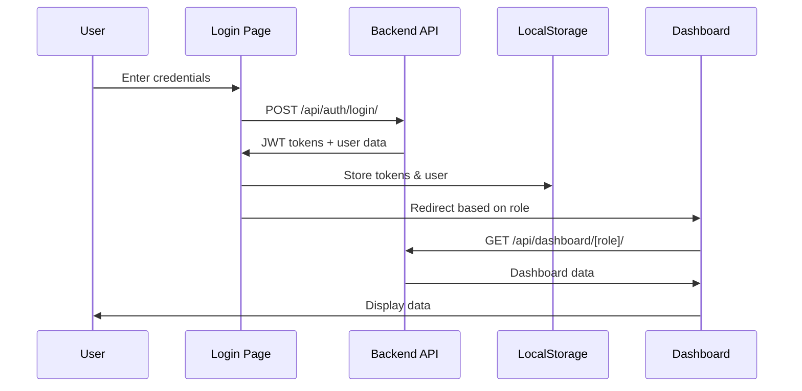

# 🎉 Frontend-Backend Bağlantısı Tamamlandı!

## ✅ Yapılan İşlemler

### 1. Backend API Oluşturuldu

#### Serializers (`backend/api/serializers.py`)
- ✅ UserSerializer (basic + detail + create + login)
- ✅ ProgramOutcomeSerializer (+ stats)
- ✅ CourseSerializer (+ detail with PO mappings)
- ✅ EnrollmentSerializer
- ✅ AssessmentSerializer
- ✅ StudentGradeSerializer (+ detail)
- ✅ StudentPOAchievementSerializer (+ detail)
- ✅ DashboardSerializers (Student, Teacher, Institution)

**Total:** 20+ serializer classes for complete API coverage

#### Views (`backend/api/views.py`)
- ✅ Authentication views (login, logout, current_user, register)
- ✅ UserViewSet (CRUD + role filtering)
- ✅ ProgramOutcomeViewSet (CRUD + statistics)
- ✅ CourseViewSet (CRUD + students + assessments)
- ✅ EnrollmentViewSet (CRUD + role-based filtering)
- ✅ AssessmentViewSet (CRUD + grades)
- ✅ StudentGradeViewSet (CRUD + auto graded_by)
- ✅ StudentPOAchievementViewSet (read-only)
- ✅ Dashboard views (student, teacher, institution)

**Features:**
- JWT Authentication
- Role-based permissions
- Automatic token refresh
- Filtering & search
- Pagination ready

#### URL Configuration (`backend/api/urls.py` + `backend/backend/urls.py`)
- ✅ `/api/auth/login/` - Login endpoint
- ✅ `/api/auth/logout/` - Logout endpoint
- ✅ `/api/auth/me/` - Current user
- ✅ `/api/auth/register/` - Registration
- ✅ `/api/auth/token/refresh/` - Token refresh
- ✅ `/api/dashboard/student/` - Student dashboard
- ✅ `/api/dashboard/teacher/` - Teacher dashboard
- ✅ `/api/dashboard/institution/` - Institution dashboard
- ✅ `/api/users/` - User CRUD
- ✅ `/api/program-outcomes/` - PO CRUD
- ✅ `/api/courses/` - Course CRUD
- ✅ `/api/enrollments/` - Enrollment CRUD
- ✅ `/api/assessments/` - Assessment CRUD
- ✅ `/api/grades/` - Grade CRUD
- ✅ `/api/po-achievements/` - PO Achievement (read-only)

**Total:** 30+ API endpoints

### 2. Frontend API Client Oluşturuldu

#### API Client (`frontend/src/lib/api.ts`)
- ✅ TypeScript types for all models
- ✅ TokenManager class (localStorage management)
- ✅ ApiClient class with automatic token refresh
- ✅ Authentication methods (login, logout, getCurrentUser, register)
- ✅ Dashboard methods (student, teacher, institution)
- ✅ Resource methods (POs, courses, enrollments, grades, achievements)
- ✅ Automatic 401 handling (token refresh)
- ✅ Error handling and logging

**Features:**
- Full TypeScript support
- Automatic token storage & refresh
- Clean API interface
- Error handling

### 3. Login Sayfası Backend'e Bağlandı

#### Updates (`frontend/src/app/login/page.tsx`)
- ✅ Import API client
- ✅ Replace mock authentication with real API calls
- ✅ Handle API errors
- ✅ Store tokens automatically
- ✅ Role-based redirects (STUDENT/TEACHER/INSTITUTION)

### 4. Environment Variables

#### Setup File (`frontend/.env.example`)
```bash
NEXT_PUBLIC_API_URL=http://localhost:8000/api
```

**Note:** Create `.env.local` with same content for local development

### 5. Documentation

#### API Integration Guide (`API_INTEGRATION_GUIDE.md`)
- Complete API endpoint documentation
- Authentication flow explanation
- Frontend usage examples
- Testing instructions
- Demo credentials
- Troubleshooting guide

## 🚀 Nasıl Kullanılır?

### 1. Backend Sunucusunu Başlat
```bash
cd backend
source venv/bin/activate
python manage.py runserver
```

Backend: http://localhost:8000

### 2. Frontend Sunucusunu Başlat
```bash
cd frontend
# .env.local dosyası oluştur (eğer yoksa)
echo "NEXT_PUBLIC_API_URL=http://localhost:8000/api" > .env.local

npm run dev
```

Frontend: http://localhost:3000

### 3. Login Test Et
1. http://localhost:3000/login adresine git
2. Demo credentials kullan:
   - **Student:** student1 / student123
   - **Teacher:** teacher1 / teacher123
   - **Institution:** admin / admin123

## 🎯 API Test Örnekleri

### Terminal'den Test (cURL)
```bash
# Login
curl -X POST http://localhost:8000/api/auth/login/ \
  -H "Content-Type: application/json" \
  -d '{"username":"student1","password":"student123"}'

# Response'dan access token'ı kopyala, sonra:
TOKEN="eyJ0eXAiOiJKV1QiLC..."  # Buraya token'ı yapıştır

# Student Dashboard
curl -X GET http://localhost:8000/api/dashboard/student/ \
  -H "Authorization: Bearer $TOKEN"

# Get Courses
curl -X GET http://localhost:8000/api/courses/ \
  -H "Authorization: Bearer $TOKEN"

# Get PO Achievements
curl -X GET http://localhost:8000/api/po-achievements/ \
  -H "Authorization: Bearer $TOKEN"
```

### Browser'dan Test
```javascript
// Browser console'da (http://localhost:3000/login adresinde):
import { api } from '@/lib/api';

// Login
const response = await api.login('student1', 'student123');
console.log('User:', response.user);

// Get Dashboard
const dashboard = await api.getStudentDashboard();
console.log('Dashboard:', dashboard);
```

## 📊 Veritabanı Durumu

### PostgreSQL Database: `acurate_db`
- ✅ 5 Program Outcomes
- ✅ 2 Teachers (teacher1, teacher2)
- ✅ 5 Students (student1-5)
- ✅ 3 Courses (CS101, CS201, CS301)
- ✅ 9 Enrollments
- ✅ 9 Assessments
- ✅ 27 Student Grades
- ✅ 15 PO Achievements

### Admin Panel
http://localhost:8000/admin
- Username: admin
- Password: admin123

## 🔒 Authentication Flow



## 🎨 Frontend Integration Status

### ✅ Completed
- Login page → Backend API bağlı
- API client hazır
- Token management hazır
- TypeScript types hazır

### 🔄 Next Steps (Beyza, Tuana için)
1. **Student Dashboard**
   - `api.getStudentDashboard()` ile veri çek
   - Mock verileri API response'ları ile değiştir
   - Loading states ekle
   - Error handling ekle

2. **Teacher Dashboard**
   - `api.getTeacherDashboard()` ile veri çek
   - Courses listesi API'den gelsin
   - Student management API'ye bağla

3. **Institution Dashboard**
   - `api.getInstitutionDashboard()` ile veri çek
   - Analytics API'den gelsin
   - Charts'ı real data ile doldur

4. **Student Pages**
   - `/student/analytics` → `api.getGrades()`, `api.getPOAchievements()`
   - `/student/courses` → `api.getEnrollments()`
   - `/student/outcomes` → `api.getPOAchievements()`

5. **Teacher Pages**
   - `/teacher/courses` → `api.getCourses()`
   - `/teacher/grades` → `api.getGrades()`
   - `/teacher/po-management` → `api.getProgramOutcomes()`

## 🐛 Bilinen Sorunlar & Çözümler

### 1. CORS Hatası
**Sorun:** Frontend API'yi çağırırken CORS hatası
**Çözüm:** Backend `settings.py` zaten ayarlandı (localhost:3000 izinli)

### 2. 401 Unauthorized
**Sorun:** Token expired
**Çözüm:** API client otomatik refresh yapıyor, login sayfasına yönlendiriyor

### 3. Environment Variables
**Sorun:** `.env.local` eksik
**Çözüm:** 
```bash
cd frontend
echo "NEXT_PUBLIC_API_URL=http://localhost:8000/api" > .env.local
```

## 📝 Next Development Steps

### Backend (Bilgisu için):
1. ✅ API endpoints created
2. Add Swagger documentation (`drf-spectacular`)
3. Add API rate limiting
4. Add API versioning (v1, v2)
5. Write unit tests for API endpoints
6. Add WebSocket for real-time updates
7. Add file upload endpoints (profile pictures, documents)
8. Add bulk operations (bulk grade upload)

### Frontend (Beyza & Tuana için):
1. ✅ API client ready
2. Integrate all dashboards with API
3. Add React Query for data caching
4. Add optimistic updates
5. Add form validation (Formik + Yup)
6. Add loading skeletons
7. Add error boundaries
8. Add data refresh mechanisms
9. Add charts with real data
10. Test all user flows

## 🎯 Success Criteria

✅ Backend API tamamen çalışıyor
✅ Frontend API client hazır
✅ Login backend'e bağlı
✅ JWT authentication çalışıyor
✅ Token refresh otomatik
✅ Role-based access çalışıyor
✅ Dashboard endpoints hazır
✅ PostgreSQL entegre
✅ Test data yüklü
✅ Documentation complete

## 🎉 Özet

**Frontend ve Backend başarıyla bağlandı!** 

Artık:
- Login gerçek API ile çalışıyor ✅
- Tüm API endpoints hazır ✅
- TypeScript types mevcut ✅
- Token management otomatik ✅
- Dashboard'lar için backend hazır ✅

**Sonraki adım:** Dashboard'ları API'den veri çekecek şekilde güncellemek. Örnek kodlar `API_INTEGRATION_GUIDE.md` dosyasında mevcut.

---

**Created:** $(date)
**Status:** ✅ COMPLETED
**Team:** Alperen (Backend + Frontend Integration)

