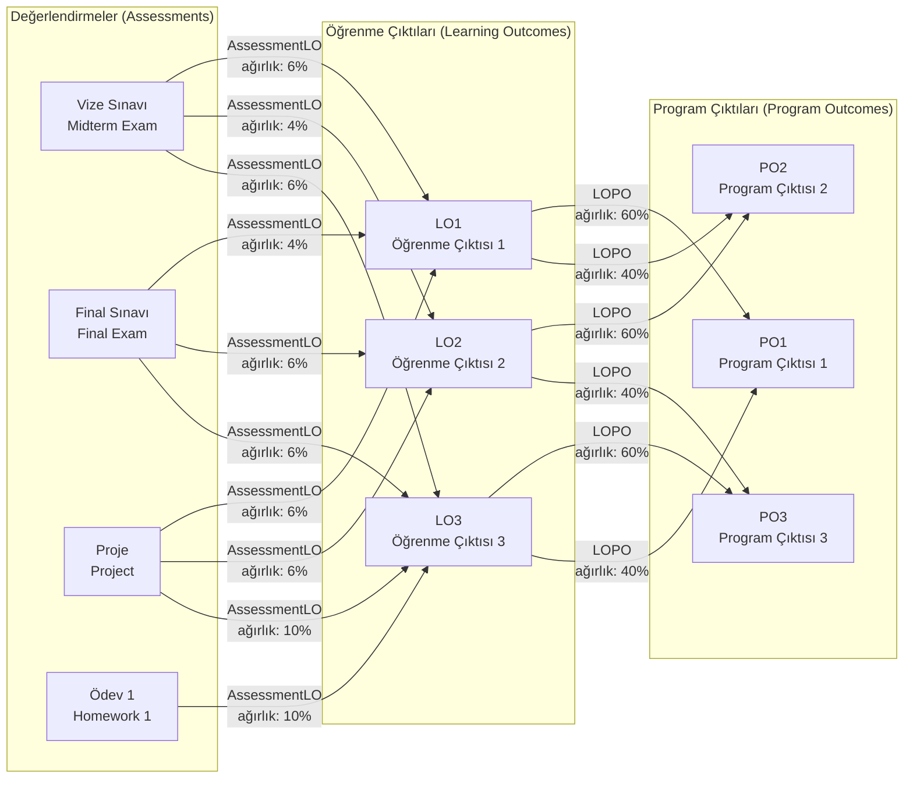
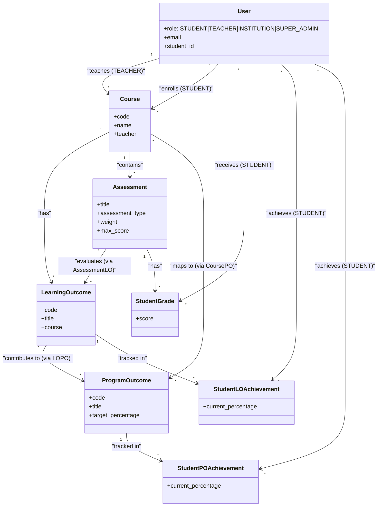

# AcuRate Sistem Sınıf Diyagramı

## Genel Bakış

AcuRate, öğrenci başarılarını üç seviyeli hiyerarşi ile takip eden bir eğitim yönetim sistemidir:

**Program Çıktısı (PO)** ← **Öğrenme Çıktısı (LO)** ← **Değerlendirme (Assessment)**

Bu dokümantasyon sistemin temel yapısını basit ve anlaşılır şekilde gösterir.

## Akış Diyagramı (Learning Flow Graph)

Aşağıdaki diyagram sistemin veri akışını gösterir: Assessment'lar → Learning Outcomes → Program Outcomes



## Sınıf Diyagramı

Aşağıdaki diyagram AcuRate sisteminin veritabanı model yapısını gösterir:



## Sistem Yapısı

### Kullanıcı Rolleri

Sistemde 4 farklı kullanıcı rolü vardır:

- **STUDENT**: Öğrenci - Kendi derslerini, notlarını ve başarılarını görüntüler
- **TEACHER**: Öğretmen - Ders yönetir, değerlendirme oluşturur, öğrencileri notlandırır
- **INSTITUTION**: Kurum Admin - Tüm analitikleri görüntüler, öğretmen oluşturur
- **SUPER_ADMIN**: Süper Admin - Sistem yönetimi yapar

### Üç Seviyeli Hiyerarşi

```
Program Çıktısı (PO)
    ↑ (LOPO ile ağırlıklı bağlantı)
Öğrenme Çıktısı (LO)
    ↑ (AssessmentLO ile ağırlıklı bağlantı)
Değerlendirme (Assessment)
    ↓ (StudentGrade ile not)
Öğrenci Başarısı
```

**Akış Yönü:**
- Assessment'lar LO'ları değerlendirir (Assessment → LO)
- LO'lar PO'lara katkı sağlar (LO → PO)
- StudentGrade'ler Assessment'lardan oluşur
- StudentLOAchievement'ler LO'lardan hesaplanır
- StudentPOAchievement'ler PO'lardan hesaplanır

### Temel İlişkiler

**Kullanıcı İlişkileri:**
- **User (TEACHER)** → **Course**: Öğretmen ders verir
- **User (STUDENT)** → **Course**: Öğrenci derse kayıt olur (via Enrollment)
- **User (STUDENT)** → **StudentGrade**: Öğrenci not alır
- **User (STUDENT)** → **StudentLOAchievement**: Öğrenci LO başarısı kazanır
- **User (STUDENT)** → **StudentPOAchievement**: Öğrenci PO başarısı kazanır

**Ders Yapısı:**
- **Course** → **LearningOutcome**: Her dersin öğrenme çıktıları vardır (ForeignKey)
- **Course** → **Assessment**: Her derste değerlendirmeler yapılır (ForeignKey)
- **Course** ↔ **ProgramOutcome**: Dersler program çıktılarına bağlanır (ManyToMany via CoursePO)

**Değerlendirme Akışı:**
- **Assessment** ↔ **LearningOutcome**: Sınavlar LO'ları değerlendirir (ManyToMany via AssessmentLO)
- **Assessment** → **StudentGrade**: Değerlendirmeler öğrenci notlarına dönüşür

**Başarı Hesaplama:**
- **LearningOutcome** ↔ **ProgramOutcome**: LO'lar PO'lara katkı sağlar (ManyToMany via LOPO)
- **LearningOutcome** → **StudentLOAchievement**: LO başarıları takip edilir
- **ProgramOutcome** → **StudentPOAchievement**: PO başarıları takip edilir

## Detaylı Model Açıklamaları

### Ana Modeller

**User (Kullanıcı)**
- 4 rol: STUDENT, TEACHER, INSTITUTION, SUPER_ADMIN
- Öğrenciler: student_id, department, year_of_study
- Öğretmenler: Course'ları yönetir (teacher ForeignKey)
- Kurum Admin: Tüm sistemi görüntüler

**Course (Ders)**
- code, name, department
- teacher: Dersi veren öğretmen (User, ForeignKey, role=TEACHER)
- enrolled_students: Kayıtlı öğrenciler (ManyToMany via Enrollment)
- program_outcomes: Dersin bağlı olduğu program çıktıları (ManyToMany via CoursePO)

**ProgramOutcome (Program Çıktısı)**
- code (örn: PO1, PO2)
- title, description
- target_percentage: Hedef başarı yüzdesi (varsayılan: 70%)
- courses: Bağlı dersler (ManyToMany via CoursePO)
- learning_outcomes: Bağlı öğrenme çıktıları (ManyToMany via LOPO)

**LearningOutcome (Öğrenme Çıktısı)**
- code (örn: LO1, LO2)
- course: Hangi derse ait (ForeignKey)
- program_outcomes: Bağlı olduğu program çıktıları (ManyToMany via LOPO)
- assessments: Değerlendiren sınavlar (ManyToMany via AssessmentLO)

**Assessment (Değerlendirme)**
- title, assessment_type (Midterm, Final, Quiz, vb.)
- course: Hangi derse ait (ForeignKey)
- weight: Final notundaki ağırlığı
- max_score: Maksimum puan
- related_los: Değerlendirdiği öğrenme çıktıları (ManyToMany via AssessmentLO)

**StudentGrade (Öğrenci Notu)**
- student: Öğrenci (User, ForeignKey, role=STUDENT)
- assessment: Değerlendirme (ForeignKey)
- score: Alınan puan

**StudentLOAchievement (LO Başarısı)**
- student: Öğrenci (User, ForeignKey, role=STUDENT)
- learning_outcome: Öğrenme çıktısı (ForeignKey)
- current_percentage: Mevcut başarı yüzdesi

**StudentPOAchievement (PO Başarısı)**
- student: Öğrenci (User, ForeignKey, role=STUDENT)
- program_outcome: Program çıktısı (ForeignKey)
- current_percentage: Mevcut başarı yüzdesi

### Bağlantı Modelleri (Through Models)

**CoursePO**: Ders ↔ Program Çıktısı bağlantısı (ağırlık ile)
- course → ProgramOutcome
- weight: 0.1-10.0

**LOPO**: Öğrenme Çıktısı ↔ Program Çıktısı bağlantısı (ağırlık ile)
- learning_outcome → ProgramOutcome
- weight: 0.01-10.0

**AssessmentLO**: Değerlendirme ↔ Öğrenme Çıktısı bağlantısı (ağırlık ile)
- assessment → LearningOutcome
- weight: 0.01-10.0

**Enrollment**: Öğrenci ↔ Ders kayıt bağlantısı
- student → Course
- final_grade: Dersin final notu

## Başarı Hesaplama Akışı

Sistem başarıları kademeli olarak hesaplar:

1. **StudentGrade** oluşturulur/güncellenir
2. **Django Signal** başarı hesaplamasını tetikler
3. **LO Başarısı** hesaplanır:
   - LO'ya bağlı tüm Assessment'ların StudentGrade'leri toplanır
   - AssessmentLO ağırlıkları ile çarpılır
   - Yüzde hesaplanır: `(ağırlıklı_toplam / toplam_ağırlık) * 100`
4. **PO Başarısı** hesaplanır:
   - PO'ya bağlı tüm LO başarıları toplanır
   - LOPO ağırlıkları ile çarpılır
   - Yüzde hesaplanır: `(ağırlıklı_toplam / toplam_ağırlık) * 100`

### Hesaplama Örneği

```
Değerlendirme: Vize (max_score: 100)
  └─ AssessmentLO: ağırlık = 0.6 → LO1
  └─ AssessmentLO: ağırlık = 0.4 → LO2

Öğrenci Notu: puan = 85
  └─ LO1 Başarısı: (85 * 0.6) / 0.6 = 85%
  └─ LO2 Başarısı: (85 * 0.4) / 0.4 = 85%

LO1
  └─ LOPO: ağırlık = 0.7 → PO1
LO2
  └─ LOPO: ağırlık = 0.3 → PO1

PO1 Başarısı: (LO1 * 0.7 + LO2 * 0.3) / (0.7 + 0.3) = 85%
```

## Model Dosya Konumları

Tüm modeller `backend/api/models/` klasöründe:

- `user.py`: User, PasswordResetToken, PasswordHistory
- `department.py`: Department
- `outcome.py`: ProgramOutcome
- `course.py`: Course, CoursePO, Enrollment
- `learning_outcome.py`: LearningOutcome, LOPO
- `assessment.py`: Assessment, AssessmentLO, StudentGrade
- `achievement.py`: StudentPOAchievement, StudentLOAchievement
- `misc.py`: ContactRequest, ActivityLog

Modeller `backend/api/models/__init__.py` dosyasında import edilmiştir.

## Referanslar

- **Model Tanımları**: `backend/api/models/`
- **Veritabanı Şeması**: Django migrations ile `backend/api/migrations/` klasöründe oluşturulur
- **Signal Handler'lar**: `backend/api/signals.py` (başarı hesaplamaları için)
